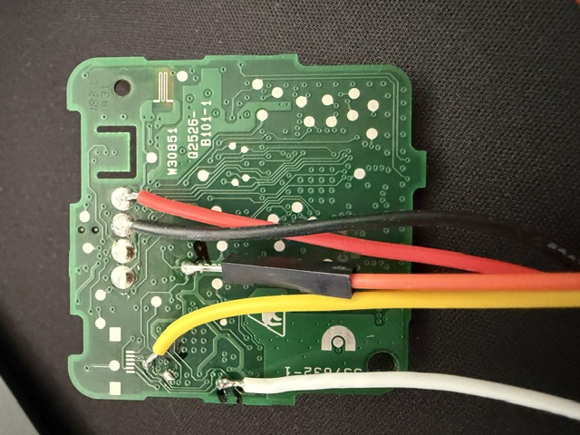
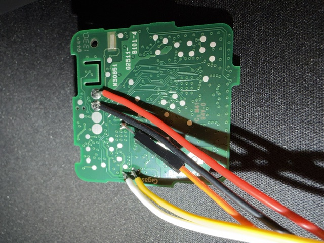

# Reading the UM01 firmware

The `um01` universal sensor is calibrated with two ULE commands. Their names
cannot be found anywhere on the base station: every binary there (`tram`,
`coco`, `uleapp`, both kernels, recovery, both data partitions) was searched and
the only calibration command present is `cal`, in `/usr/bin/calibrate.sh`. The
base does not parse, translate or filter the command at all - it forwards the
string to the node as an opaque payload. The vocabulary therefore lives only in
the node's own firmware.

This document describes how that firmware was read, so the result can be
verified or repeated on other node types.

**No firmware image is distributed with this project.** Only the command names
are, and those are facts needed for interoperability.

## What is inside a UM01

Board `337632-1` / `W30851` / `Q2526-B101-1`, powered by a CR123A cell. There
are two processors:

- a shielded DECT ULE radio module, labelled `Q2526-B101`
- a **Silicon Labs EFM32G Gecko** in a QFN32 package - the application MCU

The EFM32 runs the sensor logic and holds the command parser. It is an ARM
Cortex-M3 with a standard SWD debug port. On the unit examined here the debug
port was **not locked**, so the flash could be read without modifying anything.

## Finding the debug pins

The row of four tinned pads on the underside is **not** the debug port. Two of
them are ground and supply, the other two lead elsewhere.

SWD is on the chip itself. For the whole EFM32 family the debug pins are `PF0`
and `PF1`; on this QFN32 package that is:

| chip pin | function |
|---|---|
| 25 | `PF0` = `SWCLK` |
| 26 | `PF1` = `SWDIO` |
| 9 | `RESETn` |

> QFN pins are counted **anticlockwise** from the index dot: left edge 1-8,
> bottom edge 9-16, right edge 17-24, and the **top edge 25-32 from right to
> left**. Counting the top edge left to right lands on pins 32 and 31, which are
> ordinary GPIO and behave exactly like a dead debug port. This is the single
> most likely mistake and it costs hours.

Ground and 3.3 V can be taken from pads 3 and 4 of that row on the underside;
remove the battery first so the two supplies cannot fight. `SWCLK`, `SWDIO` and
`RESETn` are reachable from vias on the underside that lead to chip pins 25, 26
and 9, which is easier to solder than the 0.5 mm pitch of the package itself.



Wire colours in the photo:

| colour | signal |
|---|---|
| white | `SWCLK` (chip pin 25) |
| yellow | `SWDIO` (chip pin 26) |
| orange | `RESETn` (chip pin 9) |
| black | `GND` (pad 3) |
| red | `3.3 V` (pad 4) |

## Reading it

Any SWD probe works. Both an ST-Link V2 and a Raspberry Pi Pico running
`debugprobe_on_pico.uf2` were tried; the ST-Link is shown here because it can
drive the reset line.

Check that the target answers first. Nothing is written by this command:

```
openocd -f interface/stlink.cfg -c "transport select swd" -f target/efm32.cfg \
  -c "adapter speed 100" \
  -c "reset_config srst_only srst_nogate connect_assert_srst" \
  -c "init" -c "targets" -c "flash probe 0" -c "exit"
```

A working connection reports the part and the flash size:

```
Info : SWD DPIDR 0x2ba01477
Info : [efm32.cpu] Cortex-M3 r2p0 processor detected
Info : detected part: EFM32G Gecko, rev 144
Info : flash size = 128 KiB
```

Then dump it:

```
openocd -f interface/stlink.cfg -c "transport select swd" -f target/efm32.cfg \
  -c "adapter speed 950" \
  -c "reset_config srst_only srst_nogate connect_assert_srst" \
  -c "init" \
  -c "dump_image C:/path/to/um01_flash.bin 0x00000000 0x20000" \
  -c "dump_image C:/path/to/um01_devinfo.bin 0x0FE08000 0x200" \
  -c "exit"
```

Two things that waste time:

- **Do not use `reset halt`.** `connect_assert_srst` keeps the chip in reset, so
  the halt request times out. Memory reads work while the chip is held in reset,
  so `init` followed by `dump_image` is enough.
- **Use forward slashes in the output path.** OpenOCD runs the argument through
  Tcl, which eats backslashes.

Sanity-check the result before unsoldering anything: the first word of the image
is the initial stack pointer and should be inside SRAM (`0x2000xxxx`), the
second is the reset vector and should be an odd address below the flash size.

`connect_assert_srst` also covers the case where the application firmware turns
the debug pins off after boot, because the chip never gets to run.

## Extracting the command table

```
python extract_um01_commands.py um01_flash.bin
```

The commands are plain ASCII, laid out in one table next to the event names.
On the examined firmware the table sits at `0x172ec`:

```
recal  sleep  cal    cal2   chipver  do-reset  temp   press
sys1   tim1   tim2   tilt   mag      statall   cfgcrc cfgclose

scfg=  dbg=   dbg=dumpall  cfg-def=  cfg-str=  nvm=   statedbg=
buz=   um-awake=  factcfg=  cfgx=  cfgy=  cfgz=  cfgw=
```

And the events the node sends:

```
ev=open  ev=close  ev=tilt  ev=preopen  ev=button  ev=button1  ev=button2
ev=calreq  ev=cal1req  ev=cal1started  ev=cal1done
ev=cal2started  ev=cal2done  ev=caldone  ev=calreused  ev=CaliDel
ev=dmon  ev=dmoff  ev=initdone  ev=ready  ev=cfgconfirm
ev=prealert  ev=forcedentry  ev=drillalert  ev=recalrec
```

## The result

The sensor ships configured as a *umos* universal sensor. In that mode it runs a
two-step calibration that the cloud used to drive, and it **ignores the `cal`
command entirely**: the handler is reached only when the configured type is not
`um`, as the guard at `0x1280c` compares the type against the constant `0x756d`
= `"um"` and the caller skips the whole branch when it matches. That is why
guessing a `cal1` command never worked - no such command exists.

The device type is two configuration items:

| item | meaning | factory value |
|---|---|---|
| `0x0e` | first two characters of the type | `um` (`0x756d`) |
| `0x0f` | last two characters of the type | `01` (`0x3031`) |

They are written with `nvm=<2 hex digits item>-<4 hex digits value>`; the node
answers `nvm=nv0e-cnf`. Writing both turns the sensor into an ordinary window
sensor, which calibrates itself in a single step like any `ws02`:

```
nvm=0e-7773      ; "ws"
nvm=0f-3032      ; "02"
```

The new type is only read at start-up, so the node has to be restarted
afterwards - pulling the battery for a few seconds is enough. It then announces
itself as `ws02`, asks for calibration once with `ev=calreq`, and the bundled
`ws02` library answers `cal`:

```
EVENT ws02/0355594c4c ev=calreq
CRE WARN ws02-15.lua ws02 ule_command_send 0355594c4c cal
EVENT ws02/0355594c4c ev=cal1started
EVENT ws02/0355594c4c ev=caldone
```

To go back, write `nvm=0e-756d` and `nvm=0f-3031` and restart the node again.

## Why that is not the whole answer

The conversion finishes the calibration but the sensor still never reports a
position, and `statall` shows why. There are **two** sets of reference values per
axis, `m*2,m*3,m*4` and `m*5,m*6,m*7`, and the single-step `cal` writes the same
value into both:

```
mx2=-181  mx3=-206,-156  mx4=80
mx5=-181  mx6=-206,-156  mx7=80
```

With an empty range between them nothing can ever be classified as open. The
movement is not the problem: measured live values were 470 and 333 away from the
reference on two axes while the threshold `m*4` is 80.

So the two-step calibration is not a quirk of the old cloud - the hardware needs
both end positions. In `um` mode the second step really is the `cal2` command,
but the first one is not a command at all: `0x10ab0` only reports success once
two subsystem flags are set, and setting them is not something you ask for -
it happens automatically after a restart.

## The first step is `cfgclose`, not a command

`cfgclose` is the one command in the `cfg*` family that needs no arguments and
no prior `cfgx=`/`cfgy=`/`cfgz=`/`cfgw=`/`cfgcrc` - sending it alone is enough.
It does not write any calibration data by itself; what it does is stamp a
marker and trigger a genuine software reset of the sensor's application MCU.
On the next boot, the firmware notices the marker and - a few seconds later,
without any further command - captures whatever position the sensor is
currently in as the first reference. That is the moment to have the sensor
already in the position that should mean *closed*.

```
CRE WARN um01-8.lua ule_command_send um01 0355594c4c cfgclose
EVENT um01/0355594c4c res=sys
EVENT um01/0355594c4c ev=cal1started
EVENT um01/0355594c4c ev=cal1done
```

`recal` looks like it should be the first step - it is in the command table,
and the node does answer it with `ev=recalrec` - but sending it alone never
produces a calibrated reference no matter how long you wait afterwards.
Whatever it arms only feeds a state the firmware never leaves on its own.

Sending `cal2` afterwards, with the sensor moved to the position that should
mean *open*, completes the second reference the same way it always did:

```
CRE WARN um01-8.lua ule_command_send um01 0355594c4c cal2
EVENT um01/0355594c4c ev=cal2started
EVENT um01/0355594c4c ev=cal2done
```

`statall` confirms both references are now distinct, not the same value
copied into both slots as in the single-step `ws02` conversion above:

```
mx2=+5   mx3=-20,+30   mx4=80
mx5=+42  mx6=+17,+67   mx7=80
```

**One caveat for anyone repeating this with an SWD probe attached, as
described above:** the bootloader at the start of flash checks whether
`SWCLK` (chip pin 25) is held high before jumping to the application, and
enters a firmware-update mode instead if it is. A probe that is still
connected during the reset `cfgclose` triggers can hold that pin high by
itself, so the sensor comes back up in the wrong mode and never runs the
calibration logic at all. Disconnect the probe - or at least the `SWCLK`
wire - before sending `cfgclose`, and only reconnect once the sensor has
finished rebooting.

**Calibrating an `um01` works with `cfgclose` followed by `cal2`.** Everything
above the "first step" section is still accurate background; the missing
piece was that the first step is a side effect of a restart, not a command.

## Reading a DS02 (and why it can't be relabelled this way)

`ds02` and `ws02` run the same single-step calibration externally, which
raises an obvious question if you have spare `ds02` units and need a `ws02`:
can one be relabelled the way a `um01` can be turned into a `ws02` above?
Reading it answers that, but not the way we hoped.

### What is inside a DS02

Board `W30851` / `Q2511-B101-4` - the same `W30851` reference as the `um01`
board above, just paired with a different radio module. Same chip family too:
**Silicon Labs EFM32G210F128**, QFN32, rev 20 (`um01`'s was rev 144 - same
part, different die batch). Debug port unlocked, same pins as above (`PF0`
= chip pin 25 = `SWCLK`, `PF1` = chip pin 26 = `SWDIO`, chip pin 9 =
`RESETn`), read with the exact same OpenOCD commands.



Wire colours in the photo, same convention as the `um01` photo above: white
`SWCLK`, yellow `SWDIO`, black `GND`, red `3.3 V`.

### The command vocabulary isn't in this chip

`extract_um01_commands.py` and a plain case-insensitive search both come up
empty: not one of `cal`, `ver=`, `ev=`, `nvm=`, `statall`, `chipver` appears
anywhere in the 128 KiB image, even though the node visibly answers `cal` and
sends `ver=`/`ev=calreq` over the air. The reason is architectural, not
obfuscation: this EFM32 is not the ULE command parser. It talks to a second,
separate chip - the shielded DECT ULE radio module - over `USART0` at 9600
baud, using a small binary register protocol (a length-prefixed frame, an
opcode byte for register read/write, a register index, no text anywhere).
The human-readable `cal`/`ver=`/`ev=` vocabulary lives in *that* module, not
in the one this document shows how to read.

One of those registers, index `0x16`, holds a single ASCII byte: `'d'` or
`'w'`, selecting between two state machines that are both already compiled
into this same firmware. But every reference to that register in the image is
a *read* - there is no code path anywhere that writes to it, and its default
value is `0`. It has to be written by the other chip after every reset. So
the firmware genuinely knows how to run as either a door or a window sensor,
but which one it is on a given boot is a decision this chip receives, not one
it makes or remembers.

That is also why the `um01` conversion trick doesn't transfer: there is no
`nvm=`-style command here, because there is no command parser here at all.
Relabelling a `ds02` as `ws02` would mean reverse-engineering the radio
module instead - a different chip, and out of scope for this document.

The same bootloader trap as `um01` applies here too: it checks whether
`SWCLK` is held high before jumping to the application, so an SWD probe left
connected through a reset diverts the boot into firmware-update mode instead.
